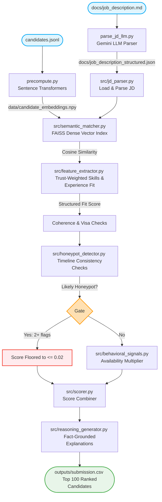

# AI Candidate Ranking System — Corporate Busters

A CPU-only, no-network, highly scalable candidate discovering and ranking system. It reads a Job Description, processes large candidate pools (tested up to 100,000 records), and surfaces the top 100 candidates that a senior technical recruiter would actually want to talk to — instead of candidates with the most keywords.

Repository link: [redrob-ai-candidate-ranking](https://github.com/DivyanshGahlaut/redrob-ai-candidate-ranking.git)

---

## 1. The Problem

Recruiters go through hundreds of profiles and often miss the right person because traditional Applicant Tracking Systems (ATS) and keyword matchers fail to see what actually matters:
- **Keyword Stuffing**: Candidates padding their skills list with trending AI terms despite having zero relevant career experience.
- **Label Mismatches**: Unrelated current titles (e.g. Marketing Manager, Accountant) claiming expert AI skills.
- **Unreliable Timelines**: tampered career histories, start/end date inconsistencies, and fabricated experience years ("honeypots").
- **Availability Gap**: A perfect-on-paper candidate who hasn't logged in for months and is unreachable.

---

## 2. Our Solution

Our hybrid ranking system combines structured constraint checks with dense vector semantics:
- **Deeper Semantic Understanding**: Swaps between custom TF-IDF + SVD (LSA) and modern transformer-based sentence embeddings (`all-MiniLM-L6-v2`) to capture career narrative relevance instead of simple keyword bag matches.
- **FAISS Vector Indexing**: L2-normalizes candidate embeddings and uses FAISS flat inner-product searches for high-speed indexing and retrieval.
- **Structured Trust Calibration**: Gates skill proficiency scores using actual duration (months) and social endorsements to neutralize keyword stuffers.
- **Multiplicative Disqualifier Checks**: Applies severe penalties for service-firm-only careers, research-only backgrounds with no production deployment, and non-India locations without visa sponsorship.
- **Honeypot Hard-Gate**: Runs 4 independent temporal and skill consistency checks, flooring any profile triggering $\ge 2$ flags.
- **Behavioral Signal Blending**: Multiplies the fit score by a recency-decayed login and response rate index.
- **Interactive AI Recruiter Assistant**: A Streamlit interface letting recruiters ask custom queries (grounded in profiles via Gemini API) to explain ranking choices in natural language.

---

## 3. Architecture



---

## 4. Tech Stack

- **Core**: Python 3.12+, Streamlit (Interactive Recruiter Dashboard)
- **Vector Search & ML**: Sentence Transformers (`all-MiniLM-L6-v2`), FAISS (`faiss-cpu`), Scikit-Learn (TF-IDF/SVD fallback)
- **Generative AI**: Google Gemini API (`google-generativeai`)
- **Data & Config**: Numpy, PyYAML, JSONL

---

## 5. Setup & How to Run

### Installation
```bash
pip install -r requirements.txt
```

### Step 1: Pre-compute Candidate Embeddings (Transformer Mode)
Decouple the heavy transformer inference from the sandboxed offline ranker by compiling candidate embeddings beforehand:
```bash
# To generate for a 5,000 candidate subset for fast test/development (~1.5 minutes):
python precompute.py --limit 5000

# To precompute embeddings for the full 100,000 candidates:
python precompute.py
```
*Note: Embeddings will be saved to `data/candidate_embeddings.npy`.*

### Step 2: (Optional) Parse Job Description using LLM
Extract high-fidelity structured constraints from the raw Job Description text using Gemini:
```bash
# Set your Gemini API Key
# Windows Powershell:
$env:GEMINI_API_KEY="your-gemini-api-key"

python parse_jd_llm.py
```
*This saves structured findings to `docs/job_description_structured.json`, which the ranker merges automatically.*

### Step 3: Run the Offline Ranker
Produce the final validated submission CSV under strict CPU-only, no-network, sub-5-minute constraints:
```bash
python rank.py --candidates ./pub_dataset/[PUB]*/India*/candidates.jsonl --out ./outputs/submission.csv
```
*If candidate embeddings exist, the ranker automatically switches to Transformer + FAISS Mode (running in under 25 seconds). If not, it falls back gracefully to TF-IDF + SVD (running in under 80 seconds).*

### Step 4: Validate the Submission File
```bash
python validate_submission.py ./outputs/submission.csv
```

### Step 5: Launch the AI Recruiter Assistant UI
```bash
streamlit run app.py
```

---

## 6. Running Unit Tests

Run verification tests locally to check feature extraction, honeypot gates, and semantic spaces:
```bash
python tests/test_feature_extractor.py
python tests/test_honeypot_detector.py
python tests/test_scorer_end_to_end.py
python tests/test_semantic_matcher_faiss.py
```

---

## 7. Team

**Team Name**: Corporate Busters  
**Members**:  
- **Divyansh Gahlaut** (ML / Backend Engineer)
