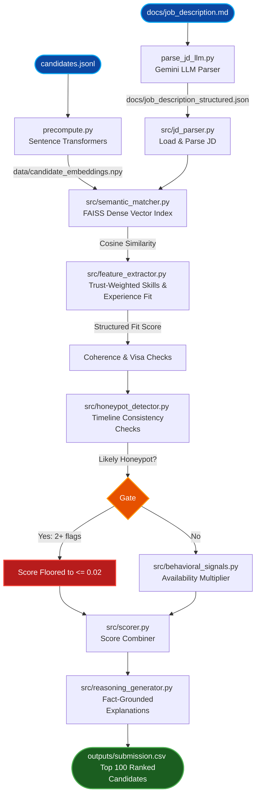

# AI Candidate Ranking System — Corporate Busters

A highly scalable AI candidate ranking system that supports both fully offline ranking and optional LLM-powered enhancements for job description understanding and recruiter assistance.

Repository link: [redrob-ai-candidate-ranking](https://github.com/DivyanshGahlaut/redrob-ai-candidate-ranking.git)

---

## 1. The Problem

Recruiters go through hundreds of profiles and often miss the right person because traditional Applicant Tracking Systems (ATS) and keyword matchers fail to see what actually matters:
- **Keyword Stuffing**: Candidates padding their skills list with trending AI terms despite having zero relevant career experience.
- **Label Mismatches**: Unrelated current titles (e.g. Marketing Manager, Accountant) claiming expert AI skills.
- **Unreliable Timelines**: tampered career histories, start/end date inconsistencies, and fabricated experience years ("honeypots").
- **Availability Gap**: A perfect-on-paper candidate who hasn't logged in for months and is unreachable.

---

## 2. Our Solution

A multi-layer recruitment engine that combines semantic search, structured scoring, and behavioral signals to produce accurate and explainable candidate rankings.

**Semantic Matching**: Uses transformer embeddings (all-MiniLM-L6-v2) with optional TF-IDF + SVD fallback to capture deep career relevance beyond keyword matching.
**Fast Retrieval**: FAISS-based vector search with L2-normalized embeddings for efficient large-scale candidate retrieval.
**Skill Trust Scoring**: Validates skills using experience duration and endorsement strength to reduce profile manipulation.
**Constraint Filtering**: Applies strict rules to remove non-viable candidates (no production work, irrelevant backgrounds, location/visa mismatch).
**Integrity Checks**: Detects inconsistencies in timelines and skill progression; flags suspicious profiles.
**Behavioral Weighting**: Uses recency and engagement signals to adjust final ranking scores dynamically.
**Final Hybrid Score**: Combines semantic fit, structured skill confidence, penalties, and behavioral factors into a single ranking score.
**AI Recruiter Interface**: Streamlit-based system with LLM explanations (Gemini API) for natural language queries and “why this candidate” reasoning.

---

## Execution Modes

### Offline Ranking Mode
- CPU-only
- No network access required
- Uses precomputed embeddings and FAISS retrieval
- Generates the final submission.csv

### Optional AI Enhancement Mode
- Gemini-powered Job Description parsing
- AI Recruiter Assistant
- Natural language explanations and candidate exploration

---

## 3. Architecture



---

## 4. Tech Stack

- **Core**: Python 3.12+, Streamlit (Interactive Recruiter Dashboard)
- **Vector Search & ML**: Sentence Transformers (`all-MiniLM-L6-v2`), FAISS (`faiss-cpu`), Scikit-Learn (TF-IDF/SVD fallback)
- **Generative AI**: Google Gemini API (`google-generativeai`)
- **Data & Config**: Numpy, PyYAML, JSONL

---

## 5. Setup & How to Run

### Installation
```bash
pip install -r requirements.txt
```

### Step 1: Pre-compute Candidate Embeddings (Transformer Mode)
Decouple the heavy transformer inference from the sandboxed offline ranker by compiling candidate embeddings beforehand:
```bash
# To generate for a 5,000 candidate subset for fast test/development (~1.5 minutes):
python precompute.py --limit 5000

# To precompute embeddings for the full 100,000 candidates:
python precompute.py
```
*Note: Embeddings will be saved to `data/candidate_embeddings.npy`.*

### Step 2: (Optional) Parse Job Description using LLM
Extract high-fidelity structured constraints from the raw Job Description text using Gemini:
```bash
# Set your Gemini API Key
# Windows Powershell:
$env:GEMINI_API_KEY="your-gemini-api-key"

python parse_jd_llm.py
```
*This saves structured findings to `docs/job_description_structured.json`, which the ranker merges automatically.*

### Step 3: Run the Offline Ranker
Produce the final validated submission CSV under strict CPU-only, no-network, sub-5-minute constraints:
```bash
python rank.py --candidates ./pub_dataset/[PUB]*/India*/candidates.jsonl --out ./outputs/submission.csv
```
*If candidate embeddings exist, the ranker automatically switches to Transformer + FAISS Mode (running in under 25 seconds). If not, it falls back gracefully to TF-IDF + SVD (running in under 80 seconds).*

### Step 4: Validate the Submission File
```bash
python validate_submission.py ./outputs/submission.csv
```

### Step 5: Launch the AI Recruiter Assistant UI
```bash
streamlit run app.py
```

---

## 6. Running Unit Tests

Run verification tests locally to check feature extraction, honeypot gates, and semantic spaces:
```bash
python tests/test_feature_extractor.py
python tests/test_honeypot_detector.py
python tests/test_scorer_end_to_end.py
python tests/test_semantic_matcher_faiss.py
```

---

## 7. Team

**Team Name**: Corporate Busters  
**Members**:  
- **Divyansh Gahlaut** (Team Leader / ML Engineer)
- **Mohd Hamza** (Backend Engineer)
- **Shikhar Vajpayi** (Data Analyst)
- **Nimisha Tiwari** (ML Engineer)
